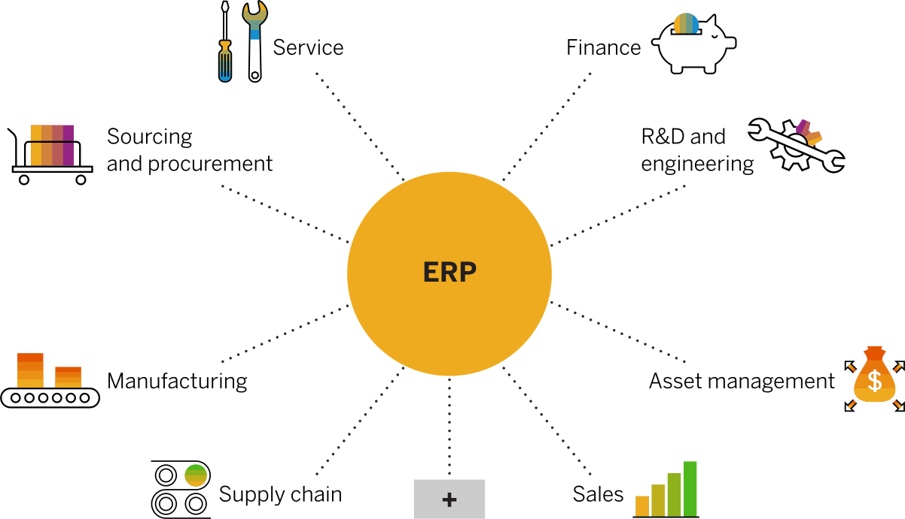

## ERP là gì?

Enterprise Resource Planning (ERP): Hoạch định nguồn lực doanh nghiệp là hệ thống phần mềm giúp bạn điều hành toàn bộ doanh nghiệp của mình. Hỗ trợ tự động hóa và các quy trình về tài chính, nhân sự, sản xuất, chuỗi cung ứng, dịch vụ, mua sắm, v.v.

## Tại sao ERP quan trọng?

ERP đôi khi được mô tả như là: "Hệ thống thần kinh trung ương của một doanh nghiệp". Một hệ thống phần mềm cung cấp sự tự động hóa, tích hợp và thông minh là điều cần thiết để điều hành hiệu quả tất cả các hoạt động kinh doanh hàng ngày. Hầu hết hoặc tất cả dữ liệu của một tổ chức nên nằm trong hệ thống ERP để cung cấp một nguồn sự thật duy nhất trong toàn bộ doanh nghiệp.

Lĩnh vực tài chính đòi hỏi một ERP để nhanh chóng đóng sổ sách. Lĩnh vực bán hàng cần ERP để quản lý tất cả các đơn đặt hàng của khách hàng. Lĩnh vực Logistics dựa vào phần mềm ERP hoạt động tốt để cung cấp các sản phẩm và dịch vụ phù hợp cho khách hàng đúng thời hạn. Các khoản phải trả cần ERP thanh toán cho nhà cung cấp một cách chính xác và đúng hạn. Quản lý cần có tầm nhìn tức thì về hiệu suất của công ty để đưa ra quyết định kịp thời. Và các ngân hàng và cổ đông yêu cầu hồ sơ tài chính chính xác, vì vậy họ dựa vào dữ liệu và phân tích đáng tin cậy do ERP thực hiện

## Sáu lợi ích chính của ERP

<ol>
<li>Higher productivity (Năng suất cao hơn): Hợp lý hóa và tự động hóa các quy trình kinh doanh cốt lõi của bạn để giúp mọi người trong tổ chức của bạn làm được nhiều việc hơn với ít tài nguyên hơn</li>
<li>
Deeper insights (Thông tin chuyên sâu hơn): Loại bỏ các silo thông tin, có được một nguồn sự thật duy nhất và nhận câu trả lời nhanh chóng cho các câu hỏi kinh doanh quan trọng.
</li>
<li>
Accelerated reporting (Báo cáo nhanh): Báo cáo tài chính và kinh doanh nhanh chóng và dễ dàng chia sẻ kết quả. Hành động dựa trên thông tin chuyên sâu và cải thiện hiệu suất trong thời gian thực.
</li>
<li>
Lower risk (Rủi ro thấp hơn): Tối đa hóa khả năng hiển thị và kiểm soát kinh doanh, đảm bảo tuân thủ các yêu cầu quy định, dự đoán và ngăn ngừa rủi ro.
</li>
<li>
Simpler IT (CNTT đơn giản hơn):Bằng cách sử dụng các ứng dụng ERP tích hợp chia sẻ cơ sở dữ liệu, bạn có thể đơn giản hóa CNTT và cung cấp cho mọi người một cách dễ dàng hơn để làm việc.
</li>
<li>
Improved agility (cải thiện sự nhanh nhẹn): Với hoạt động hiệu quả và sẵn sàng truy cập vào dữ liệu thời gian thực, bạn có thể nhanh chóng xác định và phản ứng với các cơ hội mới. 
</li>
</ol>

## Các mô-đun ERP phổ biến

Các mô-đun ERP được sử dụng rộng rãi nhất bao gồm:
<ol>
<li>
Finance (Tài chính): Mô-đun tài chính kế toán là xương sống của hầu hết các hệ thống ERP. Ngoài việc quản lý sổ cái chung và tự động hóa các nhiệm vụ tài chính chính, nó giúp doanh nghiệp theo dõi các khoản phải trả (AP: Payable) và các khoản phải thu (AR: Receivable), đóng sổ sách hiệu quả, tạo báo cáo tài chính, tuân thủ các tiêu chuẩn ghi nhận doanh thu, giảm thiểu rủi ro tài chính và hơn thế nữa.
</li>
<li>
Human resources management (Quản lý nguồn nhân lực): Hầu hết các hệ thống ERP bao gồm một mô-đun nhân sự cung cấp các khả năng cốt lõi như thời gian và tham dự và bảng lương. Các tiện ích bổ sung, hoặc thậm chí toàn bộ bộ quản lý nguồn nhân lực (HCM: Human Capital Management), có thể kết nối với ERP và cung cấp chức năng nhân sự mạnh mẽ hơn - mọi thứ từ phân tích lực lượng lao động đến quản lý trải nghiệm nhân viên.
</li>
<li>
Sourcing and procurement (Tìm nguồn cung ứng và mua sắm): Mô-đun tìm nguồn cung ứng và mua sắm giúp các doanh nghiệp mua sắm các vật liệu và dịch vụ họ cần để sản xuất hàng hóa - hoặc các mặt hàng họ muốn bán lại. Mô-đun tập trung và tự động hóa việc mua hàng, bao gồm các yêu cầu báo giá, tạo hợp đồng và phê duyệt. Nó có thể giảm thiểu việc mua quá mức và mua quá mức, cải thiện các cuộc đàm phán của nhà cung cấp với các phân tích được hỗ trợ bởi AI và thậm chí kết nối liền mạch với mạng người mua.
</li>
<li>Sales (Bán hàng): Mô-đun bán hàng theo dõi thông tin liên lạc với khách hàng tiềm năng và khách hàng - đồng thời giúp đại diện sử dụng thông tin chi tiết dựa trên dữ liệu để tăng doanh số bán hàng và khách hàng tiềm năng mục tiêu với các chương trình khuyến mãi và cơ hội bán thêm phù hợp. Nó bao gồm chức năng cho quy trình đặt hàng thành tiền mặt, bao gồm quản lý đơn hàng, hợp đồng, thanh toán, quản lý hiệu suất bán hàng và hỗ trợ lực lượng bán hàng.</li>
<li>
Manufacturing (Sản xuất): Mô-đun sản xuất là một thành phần lập kế hoạch và thực hiện chính của phần mềm ERP. Nó giúp các công ty đơn giản hóa các quy trình sản xuất phức tạp và đảm bảo sản xuất phù hợp với nhu cầu. Mô-đun này thường bao gồm chức năng lập kế hoạch yêu cầu vật liệu (MRP: Material Requirements Planning), lập kế hoạch sản xuất, thực hiện sản xuất, quản lý chất lượng, v.v. 
</li>
<li>Logistics and supply chain management (Logistics và quản lý chuỗi cung ứng): Một thành phần quan trọng khác của hệ thống ERP, mô-đun chuỗi cung ứng theo dõi sự di chuyển của hàng hóa và vật tư trong toàn bộ chuỗi cung ứng của tổ chức. Mô-đun cung cấp các công cụ để quản lý hàng tồn kho theo thời gian thực, hoạt động kho bãi, vận chuyển và hậu cần - và có thể giúp tăng khả năng hiển thị và khả năng phục hồi của chuỗi cung ứng.</li>
<li>
Service (Dịch vụ): Trong ERP, mô-đun dịch vụ giúp các công ty cung cấp dịch vụ đáng tin cậy, được cá nhân hóa mà khách hàng mong đợi. Mô-đun có thể bao gồm các công cụ để sửa chữa nội bộ, phụ tùng thay thế, quản lý dịch vụ hiện trường và luồng doanh thu dựa trên dịch vụ. Nó cũng cung cấp các phân tích để giúp các đại diện dịch vụ và kỹ thuật viên nhanh chóng giải quyết các vấn đề của khách hàng và cải thiện lòng trung thành.
</li>
<li>
R&D and engineering (R&D và kỹ thuật): Các hệ thống ERP giàu tính năng bao gồm mô-đun R &D và kỹ thuật. Mô-đun này cung cấp các công cụ để thiết kế và phát triển sản phẩm, quản lý vòng đời sản phẩm (PLM: Product Life Management), tuân thủ sản phẩm và hơn thế nữa - vì vậy các công ty có thể nhanh chóng và tiết kiệm chi phí tạo ra những cải tiến mới.
</li>
<li>
Enterprise asset management (Quản lý tài sản doanh nghiệp): Các hệ thống ERP mạnh mẽ có thể bao gồm một mô-đun EAM - giúp các doanh nghiệp sử dụng nhiều tài sản giảm thiểu thời gian chết và giữ cho máy móc và thiết bị của họ hoạt động với hiệu quả cao nhất. Mô-đun này bao gồm chức năng bảo trì dự đoán, lập lịch, vận hành và lập kế hoạch tài sản, môi trường, sức khỏe và an toàn (EHS: Health and Safety), v.v.
</li>
</ol>

Xem bài viết gốc tại: <a href="https://www.sap.com/products/erp/what-is-erp.html">What is ERP?</a>

