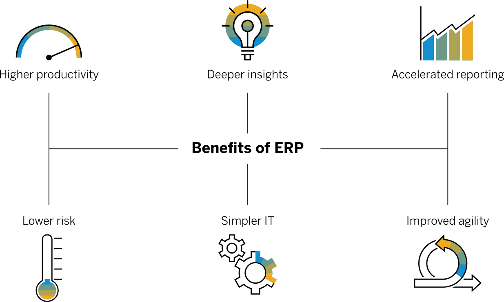

## ERP là gì?

Enterprise Resource Planning (ERP): Hoạch định nguồn lực doanh nghiệp là hệ thống phần mềm giúp bạn điều hành toàn bộ doanh nghiệp của mình. Hỗ trợ tự động hóa và các quy trình về tài chính, nhân sự, sản xuất, chuỗi cung ứng, dịch vụ, mua sắm, v.v.

## Tại sao ERP quan trọng?

ERP đôi khi được mô tả như là: "Hệ thống thần kinh trung ương của một doanh nghiệp". Một hệ thống phần mềm cung cấp sự tự động hóa, tích hợp và thông minh là điều cần thiết để điều hành hiệu quả tất cả các hoạt động kinh doanh hàng ngày. Hầu hết hoặc tất cả dữ liệu của một tổ chức nên nằm trong hệ thống ERP để cung cấp một nguồn sự thật duy nhất trong toàn bộ doanh nghiệp.

Lĩnh vực tài chính đòi hỏi một ERP để nhanh chóng đóng sổ sách. Lĩnh vực bán hàng cần ERP để quản lý tất cả các đơn đặt hàng của khách hàng. Lĩnh vực Logistics dựa vào phần mềm ERP hoạt động tốt để cung cấp các sản phẩm và dịch vụ phù hợp cho khách hàng đúng thời hạn. Các khoản phải trả cần ERP thanh toán cho nhà cung cấp một cách chính xác và đúng hạn. Quản lý cần có tầm nhìn tức thì về hiệu suất của công ty để đưa ra quyết định kịp thời. Và các ngân hàng và cổ đông yêu cầu hồ sơ tài chính chính xác, vì vậy họ dựa vào dữ liệu và phân tích đáng tin cậy do ERP thực hiện

## Sáu lợi ích chính của ERP?

<ol>
<li>Higher productivity (Năng suất cao hơn): Hợp lý hóa và tự động hóa các quy trình kinh doanh cốt lõi của bạn để giúp mọi người trong tổ chức của bạn làm được nhiều việc hơn với ít tài nguyên hơn</li>
<li>
Deeper insights (Thông tin chuyên sâu hơn): Loại bỏ các silo thông tin, có được một nguồn sự thật duy nhất và nhận câu trả lời nhanh chóng cho các câu hỏi kinh doanh quan trọng.
</li>
<li>
Accelerated reporting (Báo cáo nhanh): Báo cáo tài chính và kinh doanh nhanh chóng và dễ dàng chia sẻ kết quả. Hành động dựa trên thông tin chuyên sâu và cải thiện hiệu suất trong thời gian thực.
</li>
<li>
Lower risk (Rủi ro thấp hơn): Tối đa hóa khả năng hiển thị và kiểm soát kinh doanh, đảm bảo tuân thủ các yêu cầu quy định, dự đoán và ngăn ngừa rủi ro.
</li>
<li>
Simpler IT (CNTT đơn giản hơn):Bằng cách sử dụng các ứng dụng ERP tích hợp chia sẻ cơ sở dữ liệu, bạn có thể đơn giản hóa CNTT và cung cấp cho mọi người một cách dễ dàng hơn để làm việc.
</li>
<li>
Improved agility (cải thiện sự nhanh nhẹn): Với hoạt động hiệu quả và sẵn sàng truy cập vào dữ liệu thời gian thực, bạn có thể nhanh chóng xác định và phản ứng với các cơ hội mới. 
</li>
</ol>

## Các mô-đun ERP phổ biến?

Tham khảo bài viết gốc tại: <a href="https://www.sap.com/products/erp/what-is-erp.html">What is ERP?</a>

